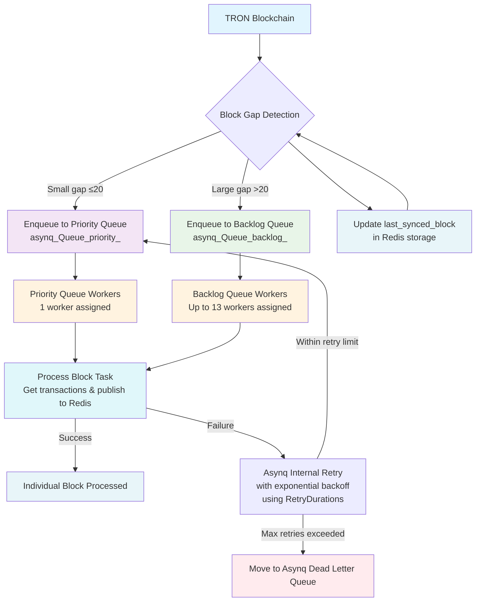

# Redis Asynq Queue System Documentation

## Overview

The TRON Events Daemon uses Redis with the Asynq queue system to manage blockchain event processing. The system implements a sophisticated queue architecture with multiple priority levels and retry mechanisms to handle the high-volume, time-sensitive nature of TRON blockchain events.

## Redis Data Structure Analysis

Based on the Redis inspection, the system uses the following key structures:

### Asynq Queue Groups

1. **Priority Queue (`priority`)**
   - Contains tasks for recent blocks (within 20 blocks of current)
   - Higher priority processing for newer events
   - 1 worker assigned by default
   - Currently has 88 retry tasks

2. **Backlog Queue (`backlog`)**
   - Contains tasks for older blocks with significant lag (>20 blocks)
   - Lower priority processing for historical data
   - Up to 13 workers assigned by default
   - Currently has 234 retry tasks

### Queue Components

Each queue contains several sub-components:

- **Active Tasks**: Currently running tasks
- **Pending Tasks**: Scheduled tasks waiting for execution
- **Retry Tasks**: Failed tasks scheduled for retry with exponential backoff
- **Processed Counters**: Track successfully completed tasks
- **Failed Counters**: Track permanently failed tasks

### TRON-Specific Keys

- `tron:events`: Redis stream containing blockchain events
- `tron:last_synced_block`: Tracks the last processed block number
- `tron:retry_queue`: (Not currently used in active inspection)
- `tron:dlq`: (Not currently used in active inspection)

## Asynq Queue Configuration

Based on the code analysis:

```go
// From pkg/worker/config.go
func DefaultConfig() asynq.Config {
    return asynq.Config{
        Concurrency: 15,  // Total max workers
        Queues: map[string]int{
            "priority": 1,  // 1 worker for new blocks
            "backlog":  13, // up to 13 workers for backlog
            "default":  1,  // 1 worker for default tasks
        },
    }
}
```

## Task Processing Workflow

The system processes TRON blockchain events through the following workflow:

1. **Real-time Event Detection**: Daemon continuously monitors TRON blockchain via scanner
2. **Block Gap Detection**: Identifies missing blocks between current and last processed
3. **Queue Assignment**:
   - Small gaps (≤20 blocks): Enqueue to `priority` queue using `asynq.Queue("priority")`
   - Large gaps (>20 blocks): Enqueue to `backlog` queue using `asynq.Queue("backlog")`
4. **Task Creation**: Creates `asynq.NewTask("block:process", payload)` with block number in payload
5. **Task Execution**: Workers process tasks from respective queues - retrieves transactions for the specific block and publishes them to Redis stream
6. **Retry Handling**: Failed tasks are automatically retried by Asynq with exponential backoff using predefined `RetryDurations` (5s, 10s, 30s, 60s, 180s, 300s, 600s, 1800s, 3600s)
7. **State Management**: The main daemon loop updates `tron:last_synced_block` in Redis storage after all gap blocks have been enqueued (not after each individual block is processed by workers)

## Retry Policy

The system uses Asynq's built-in retry mechanism with the following exponential backoff times. When a task fails, Asynq automatically retries it according to this schedule:

```go
var RetryDurations = []time.Duration{
    5 * time.Second,    // 1st retry
    10 * time.Second,   // 2nd retry
    30 * time.Second,   // 3rd retry
    60 * time.Second,   // 4th retry
    180 * time.Second,  // 5th retry
    300 * time.Second,  // 6th retry
    600 * time.Second,  // 7th retry
    1800 * time.Second, // 8th retry
    3600 * time.Second, // 9th retry
}
```

After 9 failed attempts, tasks are moved to the dead letter queue. The retry logic is handled automatically by Asynq without custom implementation code.

## Redis Key Structure

The Asynq system creates the following Redis keys:

- `asynq:{priority}:t:<task_id>`: Individual priority queue tasks (hash)
- `asynq:{backlog}:t:<task_id>`: Individual backlog queue tasks (hash)
- `asynq:{priority}:retry`: Priority queue retry tasks (sorted set)
- `asynq:{backlog}:retry`: Backlog queue retry tasks (sorted set)
- `asynq:{priority}:processed`: Counter for processed priority tasks
- `asynq:{backlog}:processed`: Counter for processed backlog tasks
- `asynq:{priority}:failed`: Counter for failed priority tasks
- `asynq:{backlog}:failed`: Counter for failed backlog tasks
- `asynq:workers`: Active worker information (sorted set)
- `asynq:servers`: Server information (sorted set)
- `asynq:queues`: Queue registry (set)

## Mermaid Flowchart



## Queue Usage Patterns

### Priority Queue
- **Purpose**: Handle recent blocks with minimal delay
- **Workers**: 1 worker (from config)
- **Use Case**: New blocks, small gaps in processing
- **Priority**: High - processed before backlog items

### Backlog Queue
- **Purpose**: Handle large historical gaps
- **Workers**: Up to 13 workers (from config)
- **Use Case**: Large gaps after daemon restart, historical data processing
- **Priority**: Lower - allows new blocks to be processed first

## System Architecture

The system implements a LIFO (Last In, First Out) processing strategy for backlog queues, ensuring that recent backlogs are processed before older ones, maintaining relevance of the data stream.

## Monitoring and Metrics

The system tracks:
- Active tasks in each queue
- Pending tasks waiting for processing
- Retry tasks with failure counts
- Processed task counters
- Failed task counters

This allows for comprehensive monitoring of system health and performance.